# Serverless Data Pipeline Architecture (Robust Version)

This document outlines the architecture and the AWS services utilized in the **Correct / Robust** data pipeline. This pipeline resolves all the intentional failures present in the flawed version by implementing production-grade AWS best practices.

## Architectural Flow
The pipeline follows an asynchronous, event-driven pattern designed for high throughput, safety, and reliability.

1. **Client / User Request**
   A user sends data (via the provided React frontend or a `curl` request) containing a JSON payload to a public HTTP endpoint.

2. **API Gateway (`ServerlessRestApi`)**
   The entry point. It receives the `POST` request at the `/process` route and routes the data directly to the Producer Lambda.

3. **Producer Lambda Function (`ProducerFunction`)**
   A lightweight AWS Lambda function. It reads the incoming request body and forwards it as a message structure to an Amazon SQS Queue. It guarantees a fast, safe 200 OK response to the API Gateway.

4. **Amazon SQS (`RobustQueue`)**
   The primary message broker. It acts as a highly resilient buffer.
   - **Fix Applied:** Configured with a `RedrivePolicy` to automatically forward poison-pill messages to a Dead-Letter Queue if they fail 3 times.

5. **Amazon SQS Dead-Letter Queue (`RobustQueueDLQ`)**
   - **Fix Applied:** A dedicated side-queue that securely holds permanently failed messages for human review, ensuring no data is ever silently dropped or lost.

6. **Consumer Lambda Function (`RobustPipelineFunction`)**
   The primary processing unit triggered by SQS.
   - **Fixes Applied:** 
     - **Batching:** Pulls messages off the queue in chunks of 10 (`BatchSize: 10`), vastly improving efficiency.
     - **Partial Batch Failures:** Returns a `batchItemFailures` array. If one item in the batch of 10 fails, only that specific item is retried; the successful 9 are not reprocessed!
     - **Idempotency:** Implements a cache (`PROCESSED_MESSAGES_CACHE`) to detect duplicate message deliveries from SQS.
     - **Timeouts:** Extended the timeout securely to 30 seconds to handle larger batches without forced AWS kills.


## AWS Services Used

### 1. Amazon API Gateway
* **Purpose**: Provides the HTTP endpoint (`/process`) and acts as the "front door" for the pipeline.

### 2. AWS Lambda
* **Purpose**: Executes our backend Python code without needing to provision or manage servers.
* **Resources**: 
  * `ProducerFunction`: Fast, reliable insertion into the Queue.
  * `RobustPipelineFunction`: Fault-tolerant data processor.

### 3. Amazon Simple Queue Service (SQS)
* **Purpose**: Decouples the producer from the consumer, providing durable asynchronous storage.

### 4. Amazon CloudWatch
* **Purpose**: Captures application logs. Because all exceptions are gracefully handled via `try/except` blocks in the corrected Python code, you will rarely see unhandled crashes here anymore.


---

### Mermaid Architecture Diagrams

#### 1. System Architecture Diagram
This flowchart visualizes the robust, fault-tolerant components mapped to their AWS services.

```mermaid
graph TD
    Client(["Client (React Frontend / API Client)"])
    AGW{"Amazon API Gateway"}
    ProdLambda["AWS Lambda (Producer)"]
    SQS[/"Amazon SQS (RobustQueue)"/]
    DLQ[/"Amazon SQS (RobustQueueDLQ)"/]
    ConsLambda["AWS Lambda (Consumer - Robust)"]
    CW[("CloudWatch Logs")]

    Client -->|HTTP POST| AGW
    AGW -->|Invoke| ProdLambda
    ProdLambda -->|Send Message| SQS
    
    SQS -->|Trigger (BatchSize: 10)| ConsLambda
    
    ConsLambda -.->|Partial Failures Returned| SQS
    SQS -.->|Failed > 3 Times| DLQ
    ConsLambda -.->|Log Clean Execution| CW
```

#### 2. Execution Sequence Diagram
This diagram outlines the lifecycle of a data request and how the correct pipeline elegantly handles duplicates and failures.

```mermaid
sequenceDiagram
    participant C as Client
    participant API as API Gateway
    participant PL as Producer Lambda
    participant SQS as Main SQS Queue
    participant FL as Robust Lambda
    participant DLQ as Dead Letter Queue

    C->>API: POST /process (JSON)
    API->>PL: Trigger Execution
    PL->>SQS: SQS SendMessage (JSON Payload)
    SQS-->>PL: Return MessageId
    PL-->>API: Return 200 OK
    API-->>C: Return 200 OK

    Note over SQS, FL: Asynchronous Trigger (Batching up to 10)
    SQS->>FL: Pass Records to Event Handler
    
    rect rgb(0, 40, 20)
    Note over FL: -- SAFE EXECUTION ZONE --
    
    loop For each record in batch
        alt If MessageId in Cache (Idempotency Check)
            FL->>FL: Skip Processing (Duplicate)
        else If Processing Fails
            FL->>FL: Add to batchItemFailures list
        else Processing Succeeds
            FL->>FL: Process Data & Add to Cache
        end
    end
    end
    
    FL-->>SQS: Return batchItemFailures
    
    opt If item failed 3 times
        SQS->>DLQ: Move poison-pill message to DLQ safely
    end
```


