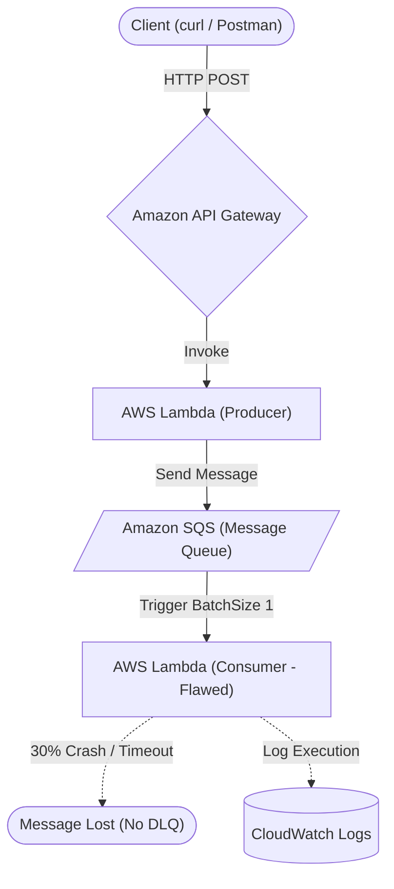
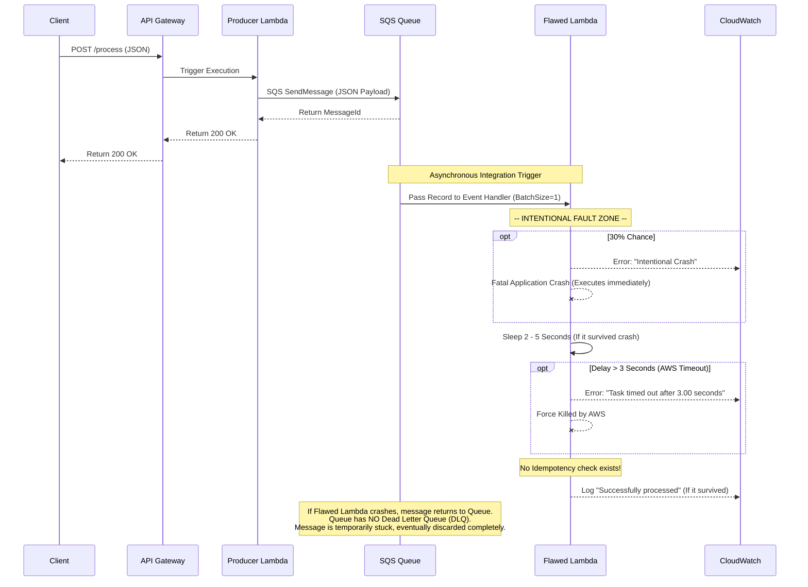

# Serverless Data Pipeline Architecture

This document outlines the architecture and the AWS services utilized in this deliberately flawed data pipeline. 

## Architectural Flow
The pipeline follows an asynchronous, event-driven pattern intended to ingest data from user requests and process them via a message queue.

1. **Client / User Request**
   A user sends data (via the provided React frontend or a `curl` request) containing JSON payload (simulated dummy data) to a public HTTP endpoint.

2. **API Gateway (`ServerlessRestApi`)**
   The entry point. It receives the `POST` request at the `/process` route and routes the data directly to the Producer Lambda.

3. **Producer Lambda Function (`ProducerFunction`)**
   A lightweight AWS Lambda function written in Python 3.12. It reads the incoming request body and forwards it as a message structure to an Amazon SQS Queue. It then safely returns a 200 OK response to the API Gateway.

4. **Amazon SQS (`FlawedQueue`)**
   The message broker. It stores incoming events and acts as a buffer. 

5. **Consumer Lambda Function (`FlawedPipelineFunction`)**
   The primary processing unit. It is configured to be triggered by SQS. It pulls messages off the queue (with a BatchSize of 1) and executes its business logic. 

## AWS Services Used

### 1. Amazon API Gateway
* **Purpose**: Provides the HTTP endpoint (`/process`) and acts as the "front door" for the pipeline.
* **Flaws**: Configured via default SAM properties. Currently allowing requests with weak security (`*` origin CORS).

### 2. AWS Lambda
* **Purpose**: Executes our backend Python code without needing to provision or manage servers.
* **Resources**: 
  * `ProducerFunction`: Hands data from the API to the Queue.
  * `FlawedPipelineFunction`: Pulls data from SQS and processes it.
* **Intentional Flaws Present**:
  * **Timeouts**: The `FlawedPipelineFunction` has a hard timeout of 3 seconds but purposefully runs a sleep command between 2 and 5 seconds, causing intermittent task timeouts.
  * **Random Crashes**: It contains a purposeful 30% chance of throwing a fatal exception during execution.
  * **Missing Concurrency Controls**: It does not establish scaling limits (`ReservedConcurrentExecutions`), meaning sudden spikes can result in uncontrolled concurrent runs.

### 3. Amazon Simple Queue Service (SQS)
* **Purpose**: Decouples the producer from the consumer. It holds messages asynchronously in case the Consumer Lambda fails or gets backed up.
* **Intentional Flaws Present**:
  * **Missing DLQ (Dead Letter Queue)**: There is no retry policy or Redrive Policy. If the Consumer Lambda fails repeatedly, the message simply stays in the queue until the default retention period causes it to be permanently lost or dropped.
  * **Batching**: The BatchSize is set to `1`, which is highly inefficient for a pipeline and increases execution volume unnecessarily.

### 4. AWS Identity and Access Management (IAM)
* **Purpose**: Secures which service is allowed to talk to which.
* **Usage**: AWS SAM inherently generated roles for our functions. For example, `ProducerFunction` is granted `SQSSendMessagePolicy` under the hood so it has permission to place items in our `FlawedQueue`.

### 5. Amazon CloudWatch
* **Purpose**: Captures application logs and exception stack traces.
* **Usage**: Logs the timeout crashes, the intentional application crashes, and allows real-time viewing of the queue processing state via `sam logs`.

### 6. AWS CloudFormation
* **Purpose**: Infrastructure as Code (IaC) deployment engine.
* **Usage**: AWS SAM transforms our `template.yaml` into CloudFormation resources to systematically provision everything on AWS.

---

### Mermaid Architecture Diagrams

#### 1. System Architecture Diagram
This flowchart visualizes the components mapped to their AWS services.

#### 2. Execution Sequence Diagram
This diagram outlines the exact step-by-step lifecycle of a data request and where the intentional flaws block execution.

